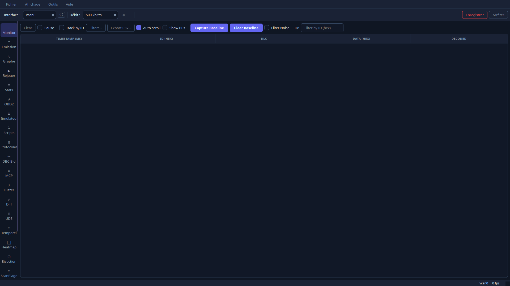
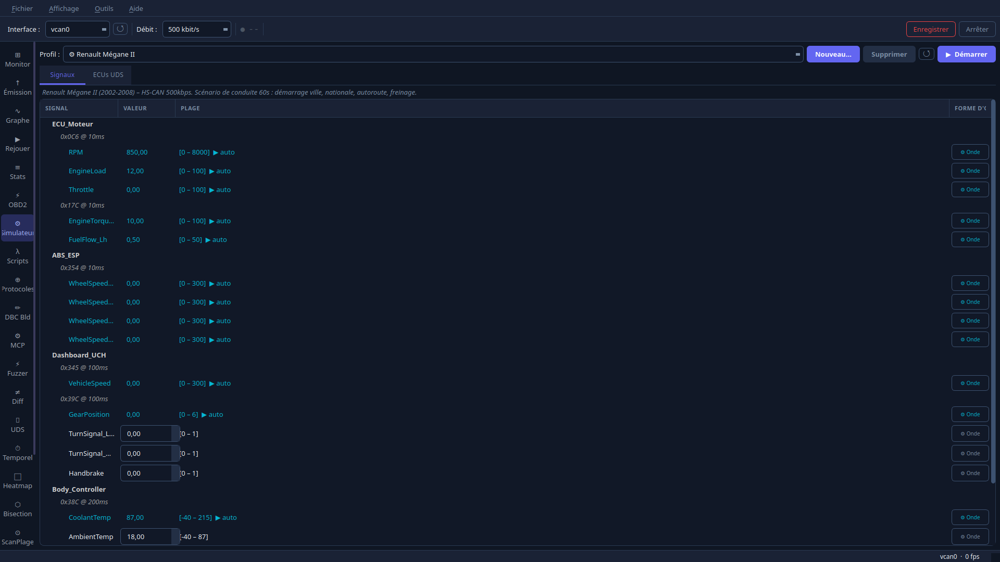
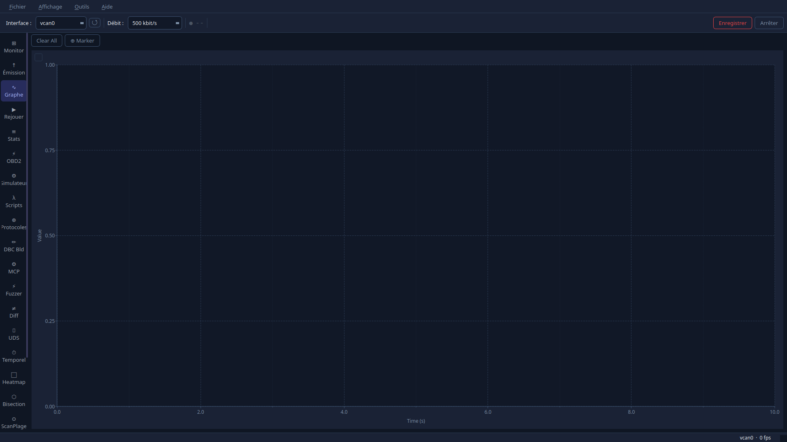
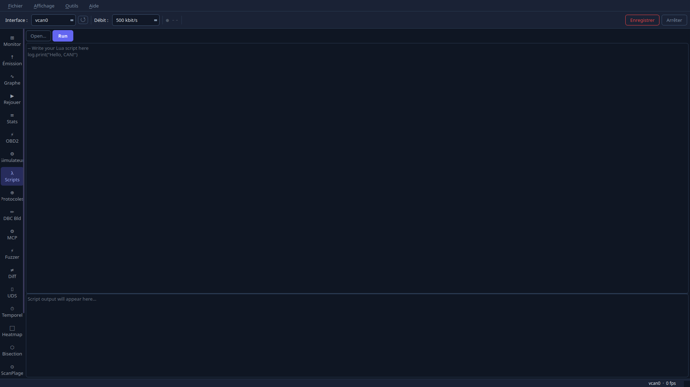
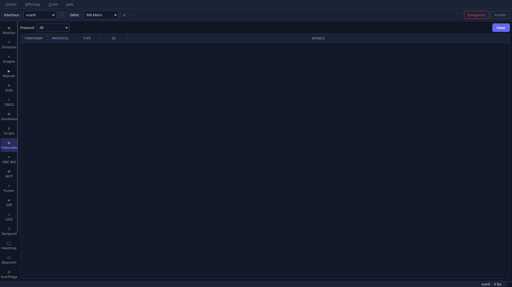
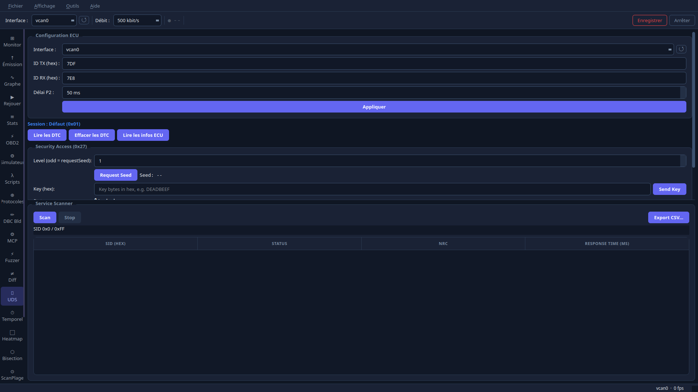

# SocketSpy — Linux CAN bus analysis platform

**[→ socketspy.dev — full documentation, screenshots & tutorials](https://poisson48.github.io/SocketSpy/)**

100% local. No telemetry, no cloud, no network calls. Built directly on Linux SocketCAN.

> **English** below · **[Français](#français)** plus bas.

---

## English

SocketSpy is a Qt6 desktop application for **analyzing, decoding, simulating and testing CAN bus traffic** on Linux. It reads any interface exposed by the SocketCAN subsystem — real USB/PCIe adapters or a virtual `vcan` — and gives you a live monitor, signal decoding, protocol decoders, graphs, scripting, fuzzing, UDS diagnostics and an MCP server, all in one window that runs entirely on your machine.

### Part of the ECU Studio Suite

SocketSpy is part of the **[ECU Studio Suite](https://github.com/Poisson48/ecu_studio_suite)** — a complete, 100% local Qt6 automotive software suite for Linux.

The suite is built around a flagship loop: **ECU Studio** flashes an ECU map, then **SocketSpy** verifies live on the CAN bus that the change took effect at the right operating point. ECU Studio handles ECU reprogramming, the 2D/3D map editor, the DAMOS editor, A2L, hex view, checksums, MPPS flash support, compare, git versioning, AutoMods and OpenDAMOS; SocketSpy handles everything that happens on the wire. Both apps share the same theme and `SidebarNav` pattern and are designed to work together.

### Download

**[→ SocketSpy-x86_64.AppImage](https://github.com/Poisson48/SocketSpy/releases/latest)** — self-contained, no installation required.

```bash
chmod +x SocketSpy-x86_64.AppImage
./SocketSpy-x86_64.AppImage
```

Requires Linux x86_64, kernel ≥ 5.4 with SocketCAN support.

### Screenshots

| Monitor | Simulator |
|---|---|
|  |  |

| Signal Graphs | Lua Scripts |
|---|---|
|  |  |

| Protocol Decoders | UDS Tester |
|---|---|
|  |  |

### Features

Maturity tags: **Proven** = stable and verified in the field · **Beta** = works but recently added / not yet field-proven.

- **Live frame monitor** — real-time scrolling table, 2000-row buffer, search by ID, pause/clear *(Proven)*
- **Signal decode** — load a `.dbc` file; signals are decoded and displayed inline *(Proven)*
- **DBC parser** — full round-trip lossless parser (`VERSION`, `BU_`, `BO_`, `SG_`, `VAL_`, `CM_`) *(Proven)*
- **Signal graphs** — up to 8 live traces on a rolling 10-second QChart window *(Proven)*
- **Frame transmit** — send standard / extended / FD frames (DLC 0–15, up to 64 bytes) with input validation *(Proven)*
- **Interface selector** — auto-detects all SocketCAN interfaces; hot-swap without restart *(Proven)*
- **Protocol decoders** — live in-app tab: CANopen NMT/SDO/PDO/EMCY, J1939, ISO-TP, UDS, OBD-II, NMEA 2000 *(Proven)*
- **Lua scripting** — in-app editor with Run/Stop + console; sandboxed Lua 5.4 engine with watchdog *(Proven)*
- **CAN simulator** — generate CAN traffic without hardware; built-in vehicle profiles or custom ones built from the UI *(Proven)*
- **io_uring capture** — high-throughput frame capture pipeline with hardware timestamps *(Proven)*
- **Frame fuzzer** — random, incremental or bit-flip frame injection at a configurable interval; per-run frame counter *(Proven)*
- **UDS tester** — ISO 14229 + ISO 15765-2 transport; Read DTC (0x19), Clear DTC (0x14), Read ECU Info via 0x22 (VIN, serial, session); live session indicator *(Proven)*
- **UDS ECU simulator** — full ISO-TP server + UDS responder (services 0x10/0x11/0x14/0x19/0x22/0x27/0x28/0x2E/0x31/0x3E); SecurityAccess seed/key; configurable DIDs and DTCs; test UDS clients without real hardware *(Proven)*
- **BLF / MDF4 export** — File → "Export BLF…" (Vector CANalyzer-compatible BLF v2) and "Export MDF4…" (asammdf / MATLAB MDF4 v4.10) *(Proven)*
- **Capture diff** — compare two captures (`.log` or `.csv`) side-by-side; diff by ID (A only / B only / Changed / Same), byte-level delta, filterable results *(Proven)*
- **Multi-bus monitor** — Tools → "+ Add Second Bus…" opens a second SocketCAN interface in parallel; a "Bus" column distinguishes frame sources *(Proven)*
- **Detachable panel navigation** — icon sidebar instead of a tab bar; drag any panel or right-click → "Detach" to float it as an independent window; Redock snaps it back *(Proven)*
- **Copy to clipboard** — Ctrl+C or right-click on any table: copy a single cell, selected rows, or the full table as TSV *(Proven)*
- **French / English UI** — full Qt i18n via `.ts` files; language choice persists across sessions *(Proven)*
- **Welcome screen** — GIMP-style floating dialog on first launch; recent projects, resource links, "don't show again", and a signed "Check for updates" action *(Proven)*
- **MCP server** — JSON-RPC 2.0 over stdio or TCP (127.0.0.1 only) exposing 11 CAN tools for LLM / Claude integration *(Beta)*
- **Signal Detective** — "Detect" sidebar panel: auto-classify all observed CAN IDs by update rate (slow / medium / fast) and signal type (digital / analog / constant / counter); a wiggle test captures a baseline then ranks the top 30 changed signals after a physical action (heuristic, no LLM) *(Beta)*
- **ELM327 bridge** — connect a serial/USB or Bluetooth (RFCOMM) ELM327 adapter and stream its frames into SocketSpy; auto-scans serial ports and discovers Bluetooth devices from the UI *(Beta)*

### Build

```bash
git clone https://github.com/Poisson48/SocketSpy
cd SocketSpy
bash scripts/dev/install_deps.sh   # install system packages (~2 min)
bash build.sh                       # configure + build (~1 min)
./build/dev/gui/socketspy           # run
```

See **[BUILDING.md](BUILDING.md)** for full instructions, supported distros and hardware setup.

### Quick start — virtual CAN (no hardware needed)

```bash
bash scripts/dev/setup_vcan.sh      # creates vcan0
./build/dev/gui/socketspy           # opens on vcan0 by default

# In another terminal — inject a test frame
cansend vcan0 123#DEADBEEF
```

### Real hardware

```bash
# Bring up your adapter (adjust bitrate: 125k / 250k / 500k / 1000k)
sudo ip link set can0 up type can bitrate 500000

# Run and select can0 in the toolbar
./build/dev/gui/socketspy
```

The toolbar auto-detects all `ARPHRD_CAN` interfaces. Hit **↺** to refresh after plugging in an adapter.

#### Supported adapters

Any adapter recognised by the Linux SocketCAN subsystem works out of the box:

| Adapter | Driver |
|---------|--------|
| CANable 2.0, CANable Pro, Seeed USB-CAN | `gs_usb` |
| PEAK PCAN-USB, PCAN-USB FD | `peak_usb` |
| Kvaser Leaf, Kvaser USBcan | `kvaser_usb` |
| Ixxat USB-to-CAN | `ixxat_usb2can` |

An **ELM327** adapter (serial/USB or Bluetooth) can also be used through the dedicated ELM327 panel, without SocketCAN.

### Lua scripts

Pre-built scripts ship in `scripts/`:

| Script | Description |
|--------|-------------|
| `tools/canopen_node_scan.lua` | Scan CANopen heartbeats (0x700–0x77F), list live nodes |
| `tools/delta_detector.lua` | Detect signal changes vs a baseline |
| `demos/ligier_pulse3/battery_scan.lua` | Read Ligier Pulse 3 BMS cell voltages via SDO |
| `demos/ligier_pulse3/contactor_boot.lua` | NMT + PDO contactor boot sequence |

See **[SCRIPTS.md](SCRIPTS.md)** for the scripting API reference.

### MCP / API — Claude integration

SocketSpy ships an MCP (Model Context Protocol) server so an LLM such as Claude can drive the CAN bus. It speaks **JSON-RPC 2.0** over **stdio** or **TCP** — and the TCP transport binds only to `127.0.0.1`, so all traffic stays on your machine. You can run it through the GUI binary (`--mcp`) or the standalone `socketspy-mcp` executable.

Add to your Claude Desktop config (`~/.config/Claude/claude_desktop_config.json` on Linux):

```json
{
  "mcpServers": {
    "socketspy": {
      "command": "/path/to/build/dev/gui/socketspy",
      "args": ["--mcp", "--iface", "can0"]
    }
  }
}
```

The server exposes **11 tools**: `can_monitor`, `can_send`, `can_decode`, `can_replay`, `can_script`, `canopen_sdo_read`, `canopen_sdo_write`, `canopen_scan`, `can_diff`, `get_stats`, `can_stop`. A ready-to-edit example lives in [`api/mcp_config_example.json`](api/mcp_config_example.json). REST and WebSocket transports are scaffolded under `api/` and are **Incoming**.

### Documentation

- **[Website — poisson48.github.io/SocketSpy](https://poisson48.github.io/SocketSpy/)** — overview, screenshots and feature tour
- **[Wiki — github.com/Poisson48/SocketSpy/wiki](https://github.com/Poisson48/SocketSpy/wiki)** — tutorials and walkthroughs (including the Renault Mégane decode tutorial)
- **[BUILDING.md](BUILDING.md)** — build from source, dependencies, supported distros
- **[SCRIPTS.md](SCRIPTS.md)** — Lua scripting API and bundled scripts
- **[SECURITY.md](SECURITY.md)** — security policy and signed-update model

### License

GPL-3.0 — see **[LICENSE](LICENSE)**.

---

## Français

**[→ socketspy.dev — documentation complète, captures d'écran & tutoriels](https://poisson48.github.io/SocketSpy/)**

100% local. Aucune télémétrie, aucun cloud, aucun appel réseau. Construit directement sur SocketCAN (Linux).

SocketSpy est une application de bureau Qt6 pour **analyser, décoder, simuler et tester le trafic d'un bus CAN** sous Linux. Elle lit n'importe quelle interface exposée par le sous-système SocketCAN — adaptateurs USB/PCIe réels ou interface virtuelle `vcan` — et fournit un moniteur en temps réel, le décodage de signaux, des décodeurs de protocoles, des graphiques, du scripting, un fuzzer, des diagnostics UDS et un serveur MCP, le tout dans une seule fenêtre qui s'exécute entièrement sur votre machine.

### Partie de l'ECU Studio Suite

SocketSpy fait partie de l'**[ECU Studio Suite](https://github.com/Poisson48/ecu_studio_suite)** — une suite logicielle automobile Qt6 complète, 100% locale, pour Linux.

La suite est bâtie autour d'une boucle phare : **ECU Studio** flashe une cartographie d'ECU, puis **SocketSpy** vérifie en direct sur le bus CAN que la modification a bien pris effet au bon point de fonctionnement. ECU Studio gère la reprogrammation d'ECU, l'éditeur de cartographies 2D/3D, l'éditeur DAMOS, l'A2L, la vue hexadécimale, les checksums, le support du flash MPPS, la comparaison, le versionnement git, les AutoMods et OpenDAMOS ; SocketSpy gère tout ce qui se passe sur le fil. Les deux applications partagent le même thème et le même motif `SidebarNav` et sont conçues pour fonctionner ensemble.

### Téléchargement

**[→ SocketSpy-x86_64.AppImage](https://github.com/Poisson48/SocketSpy/releases/latest)** — autonome, aucune installation requise.

```bash
chmod +x SocketSpy-x86_64.AppImage
./SocketSpy-x86_64.AppImage
```

Nécessite Linux x86_64, noyau ≥ 5.4 avec support SocketCAN.

### Captures d'écran

| Moniteur | Simulateur |
|---|---|
|  |  |

| Graphiques de signaux | Scripts Lua |
|---|---|
|  |  |

| Décodeurs de protocoles | Testeur UDS |
|---|---|
|  |  |

### Fonctionnalités

Étiquettes de maturité : **Éprouvé** = stable et vérifié sur le terrain · **Bêta** = fonctionnel mais récent / pas encore éprouvé sur le terrain.

- **Moniteur de trames en direct** — table défilante en temps réel, tampon de 2000 lignes, recherche par ID, pause/effacement *(Éprouvé)*
- **Décodage de signaux** — chargez un fichier `.dbc` ; les signaux sont décodés et affichés en ligne *(Éprouvé)*
- **Parseur DBC** — parseur sans perte aller-retour complet (`VERSION`, `BU_`, `BO_`, `SG_`, `VAL_`, `CM_`) *(Éprouvé)*
- **Graphiques de signaux** — jusqu'à 8 courbes en direct sur une fenêtre QChart glissante de 10 secondes *(Éprouvé)*
- **Émission de trames** — envoi de trames standard / étendues / FD (DLC 0–15, jusqu'à 64 octets) avec validation des entrées *(Éprouvé)*
- **Sélecteur d'interface** — détection automatique de toutes les interfaces SocketCAN ; changement à chaud sans redémarrage *(Éprouvé)*
- **Décodeurs de protocoles** — onglet intégré en direct : CANopen NMT/SDO/PDO/EMCY, J1939, ISO-TP, UDS, OBD-II, NMEA 2000 *(Éprouvé)*
- **Scripting Lua** — éditeur intégré avec Run/Stop + console ; moteur Lua 5.4 en bac à sable avec chien de garde *(Éprouvé)*
- **Simulateur CAN** — générez du trafic CAN sans matériel ; profils de véhicules intégrés ou personnalisés créés depuis l'interface *(Éprouvé)*
- **Capture io_uring** — pipeline de capture à haut débit avec horodatage matériel *(Éprouvé)*
- **Fuzzer de trames** — injection aléatoire, incrémentale ou par inversion de bits à intervalle configurable ; compteur de trames par session *(Éprouvé)*
- **Testeur UDS** — transport ISO 14229 + ISO 15765-2 ; lecture DTC (0x19), effacement DTC (0x14), lecture infos ECU via 0x22 (VIN, série, session) ; indicateur de session en direct *(Éprouvé)*
- **Simulateur d'ECU UDS** — serveur ISO-TP complet + répondeur UDS (services 0x10/0x11/0x14/0x19/0x22/0x27/0x28/0x2E/0x31/0x3E) ; SecurityAccess seed/key ; DID et DTC configurables ; testez des clients UDS sans matériel réel *(Éprouvé)*
- **Export BLF / MDF4** — Fichier → « Export BLF… » (BLF v2 compatible Vector CANalyzer) et « Export MDF4… » (MDF4 v4.10 asammdf / MATLAB) *(Éprouvé)*
- **Comparaison de captures** — comparez deux captures (`.log` ou `.csv`) côte à côte ; diff par ID (A seul / B seul / Modifié / Identique), delta octet par octet, résultats filtrables *(Éprouvé)*
- **Moniteur multi-bus** — Outils → « + Ajouter un second bus… » ouvre une seconde interface SocketCAN en parallèle ; une colonne « Bus » distingue les sources des trames *(Éprouvé)*
- **Navigation par panneaux détachables** — barre latérale à icônes au lieu d'une barre d'onglets ; glissez un panneau ou clic droit → « Détacher » pour le faire flotter en fenêtre indépendante ; Réancrer le recolle *(Éprouvé)*
- **Copie dans le presse-papiers** — Ctrl+C ou clic droit sur n'importe quelle table : copie d'une cellule, des lignes sélectionnées ou de la table entière en TSV *(Éprouvé)*
- **Interface français / anglais** — i18n Qt complète via fichiers `.ts` ; le choix de langue persiste entre les sessions *(Éprouvé)*
- **Écran d'accueil** — boîte de dialogue flottante façon GIMP au premier lancement ; projets récents, liens utiles, « ne plus afficher », et action signée « Vérifier les mises à jour » *(Éprouvé)*
- **Serveur MCP** — JSON-RPC 2.0 via stdio ou TCP (127.0.0.1 uniquement) exposant 11 outils CAN pour l'intégration LLM / Claude *(Bêta)*
- **Signal Detective** — panneau latéral « Detect » : classification automatique de tous les IDs CAN observés par cadence de mise à jour (lent / moyen / rapide) et par type de signal (numérique / analogique / constant / compteur) ; un test « wiggle » capture une référence puis classe les 30 signaux les plus modifiés après une action physique (heuristique, sans LLM) *(Bêta)*
- **Pont ELM327** — connectez un adaptateur ELM327 série/USB ou Bluetooth (RFCOMM) et injectez ses trames dans SocketSpy ; balayage automatique des ports série et découverte des appareils Bluetooth depuis l'interface *(Bêta)*

### Compilation

```bash
git clone https://github.com/Poisson48/SocketSpy
cd SocketSpy
bash scripts/dev/install_deps.sh   # installe les paquets système (~2 min)
bash build.sh                       # configure + compile (~1 min)
./build/dev/gui/socketspy           # lance
```

Voir **[BUILDING.md](BUILDING.md)** pour les instructions complètes, les distributions prises en charge et la configuration matérielle.

### Démarrage rapide — CAN virtuel (sans matériel)

```bash
bash scripts/dev/setup_vcan.sh      # crée vcan0
./build/dev/gui/socketspy           # s'ouvre sur vcan0 par défaut

# Dans un autre terminal — injecte une trame de test
cansend vcan0 123#DEADBEEF
```

### Matériel réel

```bash
# Activez votre adaptateur (ajustez le débit : 125k / 250k / 500k / 1000k)
sudo ip link set can0 up type can bitrate 500000

# Lancez et sélectionnez can0 dans la barre d'outils
./build/dev/gui/socketspy
```

La barre d'outils détecte automatiquement toutes les interfaces `ARPHRD_CAN`. Cliquez sur **↺** pour rafraîchir après avoir branché un adaptateur.

#### Adaptateurs pris en charge

Tout adaptateur reconnu par le sous-système SocketCAN de Linux fonctionne immédiatement :

| Adaptateur | Pilote |
|---------|--------|
| CANable 2.0, CANable Pro, Seeed USB-CAN | `gs_usb` |
| PEAK PCAN-USB, PCAN-USB FD | `peak_usb` |
| Kvaser Leaf, Kvaser USBcan | `kvaser_usb` |
| Ixxat USB-to-CAN | `ixxat_usb2can` |

Un adaptateur **ELM327** (série/USB ou Bluetooth) peut aussi être utilisé via le panneau ELM327 dédié, sans SocketCAN.

### Scripts Lua

Des scripts prêts à l'emploi sont fournis dans `scripts/` :

| Script | Description |
|--------|-------------|
| `tools/canopen_node_scan.lua` | Scanne les heartbeats CANopen (0x700–0x77F), liste les nœuds actifs |
| `tools/delta_detector.lua` | Détecte les changements de signaux par rapport à une référence |
| `demos/ligier_pulse3/battery_scan.lua` | Lit les tensions de cellules BMS de la Ligier Pulse 3 via SDO |
| `demos/ligier_pulse3/contactor_boot.lua` | Séquence de démarrage des contacteurs NMT + PDO |

Voir **[SCRIPTS.md](SCRIPTS.md)** pour la référence de l'API de scripting.

### MCP / API — intégration Claude

SocketSpy embarque un serveur MCP (Model Context Protocol) afin qu'un LLM comme Claude puisse piloter le bus CAN. Il parle **JSON-RPC 2.0** via **stdio** ou **TCP** — et le transport TCP n'écoute que sur `127.0.0.1`, donc tout le trafic reste sur votre machine. Vous pouvez le lancer via le binaire GUI (`--mcp`) ou via l'exécutable autonome `socketspy-mcp`.

Ajoutez à votre config Claude Desktop (`~/.config/Claude/claude_desktop_config.json` sous Linux) :

```json
{
  "mcpServers": {
    "socketspy": {
      "command": "/path/to/build/dev/gui/socketspy",
      "args": ["--mcp", "--iface", "can0"]
    }
  }
}
```

Le serveur expose **11 outils** : `can_monitor`, `can_send`, `can_decode`, `can_replay`, `can_script`, `canopen_sdo_read`, `canopen_sdo_write`, `canopen_scan`, `can_diff`, `get_stats`, `can_stop`. Un exemple prêt à éditer se trouve dans [`api/mcp_config_example.json`](api/mcp_config_example.json). Les transports REST et WebSocket sont préparés sous `api/` et sont **À venir**.

### Documentation

- **[Site web — poisson48.github.io/SocketSpy](https://poisson48.github.io/SocketSpy/)** — présentation, captures d'écran et tour des fonctionnalités
- **[Wiki — github.com/Poisson48/SocketSpy/wiki](https://github.com/Poisson48/SocketSpy/wiki)** — tutoriels et guides pas-à-pas (dont le tutoriel de décodage de la Renault Mégane)
- **[BUILDING.md](BUILDING.md)** — compilation depuis les sources, dépendances, distributions prises en charge
- **[SCRIPTS.md](SCRIPTS.md)** — API de scripting Lua et scripts fournis
- **[SECURITY.md](SECURITY.md)** — politique de sécurité et modèle de mise à jour signée

### Licence

GPL-3.0 — voir **[LICENSE](LICENSE)**.
